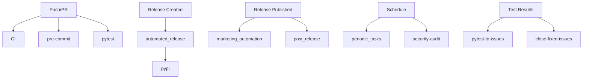

# GitHub Actions Workflows

This directory contains all GitHub Actions workflows for the Neural DSL project. These workflows automate testing, deployment, security scanning, and marketing activities.

## Workflow Overview

### CI/CD Workflows

#### `ci.yml`
Main continuous integration workflow that runs on every push and pull request.
- Runs tests across multiple Python versions
- Checks code quality
- Generates coverage reports

#### `python-package.yml`
Python package build and test workflow.
- Tests package installation
- Validates dependencies
- Ensures package integrity

#### `pytest.yml`
Dedicated test runner for the test suite.
- Runs pytest with various configurations
- Generates test reports
- Uploads coverage to Codecov

#### `pre-commit.yml`
Runs pre-commit hooks on CI.
- Code formatting checks
- Linting
- Import sorting

### Release & Deployment Workflows

#### `release.yml`
Manual release workflow for creating new versions.
- Bumps version numbers
- Creates git tags
- Generates release notes

#### `automated_release.yml`
Automated release process workflow.
- Runs tests before release
- Generates blog posts
- Validates examples
- Creates GitHub releases

#### `post_release.yml`
Post-release activities workflow.
- Posts release announcements to Twitter/X
- Updates social media
- Runs after release publication

#### `pypi.yml`
PyPI package publishing workflow.
- Builds distribution packages
- Publishes to PyPI
- Uploads to Test PyPI for testing

#### `python-publish.yml`
Alternative Python package publishing workflow.
- Handles package distribution
- Manages PyPI uploads

### Marketing & Documentation Workflows

#### `marketing_automation.yml` ⭐ NEW
**Comprehensive marketing automation workflow** that runs on release publication.

**Features:**
- ✅ Generates blog posts from CHANGELOG.md
- ✅ Publishes to Dev.to via API
- ✅ Creates Medium drafts via API
- ✅ Posts to Twitter/X via API
- ✅ Posts to LinkedIn via API
- ✅ Updates GitHub Discussions
- ✅ Commits generated blog files
- ✅ Comprehensive error handling
- ✅ Secret validation

**Triggers:**
- Release publication (automatic)
- Manual workflow dispatch

**Required Secrets:**
- `DEVTO_API_KEY` - Dev.to API key
- `MEDIUM_API_KEY` - Medium integration token
- `TWITTER_API_KEY`, `TWITTER_API_SECRET`, `TWITTER_ACCESS_TOKEN`, `TWITTER_ACCESS_TOKEN_SECRET` - Twitter API credentials
- `LINKEDIN_ACCESS_TOKEN` - LinkedIn access token

**Documentation:** [Marketing Automation Guide](../../docs/MARKETING_AUTOMATION_GUIDE.md)

#### `jekyll.yml`
Jekyll site build and deployment.
- Builds documentation site
- Deploys to GitHub Pages

### Code Quality Workflows

#### `pylint.yml`
Python linting with Pylint.
- Checks code style
- Identifies potential bugs
- Enforces coding standards

#### `codacy.yml`
Codacy code quality checks.
- Static code analysis
- Security scanning
- Code coverage

#### `complexity.yml`
Code complexity analysis.
- Measures cyclomatic complexity
- Identifies complex functions
- Reports maintainability metrics

#### `codeql.yml`
GitHub CodeQL security scanning.
- Advanced security analysis
- Vulnerability detection
- Code pattern matching

### Security Workflows

#### `security.yml`
Security scanning and auditing.
- Dependency vulnerability scanning
- Bandit security checks
- Safety checks

#### `security-audit.yml`
Comprehensive security audit workflow.
- Multiple security tool integration
- Detailed security reports
- Automated issue creation

### Maintenance Workflows

#### `periodic_tasks.yml`
Scheduled maintenance tasks.
- Runs on a schedule
- Performs routine maintenance
- Updates dependencies

#### `validate_examples.yml`
Validates example code and Neural DSL files.
- Ensures examples are up to date
- Tests example execution
- Generates validation reports

#### `close-fixed-issues.yml`
Automatically closes issues that have been fixed.
- Monitors test results
- Closes related issues when tests pass
- Updates issue status

#### `pytest-to-issues.yml`
Creates GitHub issues from test failures.
- Monitors pytest results
- Creates issues for failures
- Links to relevant code

#### `create_issues.py`
Helper script for automated issue creation.
- Parses test results
- Formats issue content
- Posts to GitHub API

### Dependency Management

#### `dependabot.yml`
Dependabot configuration (in `.github/` directory).
- Automated dependency updates
- Security patch notifications
- PR creation for updates

### Metrics & Monitoring

#### `metrics.yml`
Project metrics collection and reporting.
- Code statistics
- Test coverage trends
- Performance metrics

## Workflow Dependencies



## Required Repository Secrets

### Core Secrets
- `GITHUB_TOKEN` - Automatically provided by GitHub Actions
- `CODECOV_TOKEN` - For code coverage uploads

### PyPI Publishing
- `PYPI_API_TOKEN` - PyPI publishing token
- `TEST_PYPI_API_TOKEN` - Test PyPI token (optional)

### Marketing Automation (marketing_automation.yml)
- `DEVTO_API_KEY` - Dev.to API key
- `MEDIUM_API_KEY` - Medium integration token
- `MEDIUM_USER_ID` - Medium user ID (optional)
- `TWITTER_API_KEY` - Twitter API key
- `TWITTER_API_SECRET` - Twitter API secret
- `TWITTER_ACCESS_TOKEN` - Twitter access token
- `TWITTER_ACCESS_TOKEN_SECRET` - Twitter access token secret
- `LINKEDIN_ACCESS_TOKEN` - LinkedIn access token
- `LINKEDIN_PERSON_URN` - LinkedIn person URN (optional)

### Security Scanning
- `CODACY_PROJECT_TOKEN` - Codacy integration token (optional)

## Setting Up Secrets

1. Go to repository `Settings` → `Secrets and variables` → `Actions`
2. Click `New repository secret`
3. Add the secret name and value
4. Save the secret

## Workflow Permissions

Most workflows use the default `GITHUB_TOKEN` with these permissions:
- `contents: read` - Read repository content
- `contents: write` - Write to repository (for commits)
- `issues: write` - Create and update issues
- `pull-requests: write` - Create and update PRs
- `discussions: write` - Create discussions

## Triggering Workflows

### Automatic Triggers
- **On push to main:** CI, tests, security scans
- **On PR:** CI, tests, code quality checks
- **On release published:** Marketing automation, post-release
- **On schedule:** Periodic tasks, security audits

### Manual Triggers
Most workflows can be manually triggered via:
1. Go to `Actions` tab
2. Select the workflow
3. Click `Run workflow`
4. Fill in required inputs
5. Click `Run workflow` button

## Workflow Status Badges

Add workflow status badges to README.md:

```markdown


```

## Debugging Workflows

### View Logs
1. Go to `Actions` tab
2. Click on workflow run
3. Click on job name
4. Expand step to view logs

### Re-run Failed Jobs
1. Go to failed workflow run
2. Click `Re-run failed jobs`
3. Or click `Re-run all jobs` to run everything

### Enable Debug Logging
Add these secrets for verbose logging:
- `ACTIONS_RUNNER_DEBUG`: `true`
- `ACTIONS_STEP_DEBUG`: `true`

## Best Practices

1. **Test workflows locally** using [act](https://github.com/nektos/act)
2. **Keep secrets secure** - never commit them
3. **Use continue-on-error** for non-critical steps
4. **Add timeout** to prevent hanging jobs
5. **Cache dependencies** to speed up workflows
6. **Use matrix builds** for testing multiple versions
7. **Document required secrets** in workflow comments

## Workflow Maintenance

### Regular Updates
- Update action versions (e.g., `actions/checkout@v4`)
- Review and update Python versions
- Update dependencies in workflows
- Check for deprecated features

### Monitoring
- Review workflow run history regularly
- Monitor for failing workflows
- Check for security alerts
- Review workflow duration trends

## Common Issues

### Workflow Doesn't Trigger
- Check trigger conditions
- Verify branch names match
- Check if workflow is disabled
- Review path filters

### Secret Not Found
- Verify secret name matches exactly (case-sensitive)
- Check secret is set in correct environment
- Ensure secret has a value

### Permission Denied
- Check workflow permissions
- Verify `GITHUB_TOKEN` has required scopes
- Check branch protection rules

### Timeout Errors
- Increase timeout with `timeout-minutes`
- Optimize slow steps
- Use caching for dependencies

## Contributing to Workflows

When adding or modifying workflows:

1. **Test thoroughly** before committing
2. **Document** the workflow purpose and requirements
3. **Add error handling** for failure cases
4. **Use descriptive names** for jobs and steps
5. **Include comments** for complex logic
6. **Update this README** with new workflows
7. **Add to relevant documentation** (AUTOMATION_GUIDE.md, etc.)

## Resources

- [GitHub Actions Documentation](https://docs.github.com/en/actions)
- [Workflow Syntax](https://docs.github.com/en/actions/reference/workflow-syntax-for-github-actions)
- [GitHub Actions Marketplace](https://github.com/marketplace?type=actions)
- [Neural DSL Automation Guide](../../AUTOMATION_GUIDE.md)
- [Marketing Automation Guide](../../docs/MARKETING_AUTOMATION_GUIDE.md)

## Support

For workflow-related issues:
1. Check workflow logs in Actions tab
2. Review this documentation
3. Check [GitHub Actions community forum](https://github.community/c/code-to-cloud/github-actions/)
4. Open an issue with workflow logs attached
