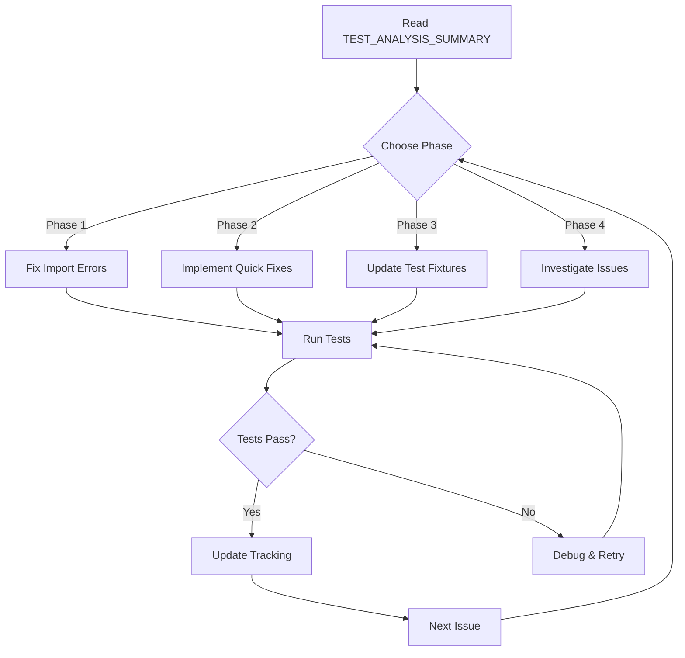

# Neural DSL - Test Suite Analysis - Document Index

**Analysis Date:** 2024  
**Test Command:** `pytest tests/ -v --tb=short`  
**Total Documentation Pages:** 6

---

## 📚 Documentation Library

| Document | Purpose | Pages | Time to Read | Priority |
|----------|---------|-------|--------------|----------|
| [TEST_SUITE_DOCUMENTATION_README.md](TEST_SUITE_DOCUMENTATION_README.md) | Navigation guide | 1 | 5 min | ⭐⭐⭐ |
| [TEST_ANALYSIS_SUMMARY.md](TEST_ANALYSIS_SUMMARY.md) | Executive summary | 1 | 10 min | ⭐⭐⭐ |
| [BUG_REPORT.md](BUG_REPORT.md) | Detailed analysis | 15 | 45 min | ⭐⭐ |
| [QUICK_FIXES.md](QUICK_FIXES.md) | Implementation guide | 10 | 30 min | ⭐⭐⭐ |
| [BUG_TRACKING.csv](BUG_TRACKING.csv) | Structured data | 1 | 5 min | ⭐⭐ |
| [bug_data.json](bug_data.json) | Machine-readable | 1 | N/A | ⭐ |

---

## 🎯 Reading Paths

### Path 1: Executive (15 minutes)
For managers and stakeholders who need high-level understanding:

1. **TEST_SUITE_DOCUMENTATION_README.md** → Quick overview
2. **TEST_ANALYSIS_SUMMARY.md** → Full context and metrics
3. **BUG_TRACKING.csv** → Review priority distribution

**Outcome:** Understand scope, priority, and effort required

---

### Path 2: Developer Quick Start (45 minutes)
For developers implementing fixes:

1. **TEST_ANALYSIS_SUMMARY.md** → Context
2. **QUICK_FIXES.md** → Detailed solutions
3. **BUG_REPORT.md** (relevant sections) → Deep dive on your module

**Outcome:** Ready to implement fixes with clear guidance

---

### Path 3: QA/Test Engineer (60 minutes)
For test engineers managing quality:

1. **TEST_ANALYSIS_SUMMARY.md** → Overall health
2. **BUG_REPORT.md** → All failure patterns
3. **BUG_TRACKING.csv** → Import into tracking system

**Outcome:** Comprehensive test strategy and tracking setup

---

### Path 4: Automation Engineer (30 minutes)
For DevOps/automation specialists:

1. **bug_data.json** → Parse and analyze
2. **TEST_ANALYSIS_SUMMARY.md** → Metrics to track
3. **QUICK_FIXES.md** → Automation opportunities

**Outcome:** CI/CD integration and monitoring setup

---

## 📊 Key Findings at a Glance

```
Test Suite Health: 73% (of runnable tests)
────────────────────────────────────────────
██████████████████████████████░░░░░░░░░░ 357 passing
████████████░░░░░░░░░░░░░░░░░░░░░░░░░░ 132 failing
██████████████████████████████████████████ 524 blocked
────────────────────────────────────────────
Total: 1,024 tests

Priorities:
  P0 (Critical):  12 bugs →  4 hours
  P1 (High):      43 bugs →  3 hours
  P2 (Medium):    43 bugs →  5 hours
  P3 (Low):       34 bugs →  1 hour
────────────────────────────────────────────
Total Fix Time: ~13 hours → 90%+ passing
```

---

## 🔥 Top Issues (Fix First)

### 1. Missing keras Import
- **Impact:** Blocks 5 test modules
- **Effort:** 5 minutes
- **Fix:** Change `import keras` to `from tensorflow import keras`
- **File:** neural/hpo/hpo.py:6

### 2. Wrong Import Path
- **Impact:** Blocks 1 test module
- **Effort:** 2 minutes
- **Fix:** Change `from parser.parser` to `from neural.parser.parser`
- **File:** neural/visualization/dynamic_visualizer/api.py:4

### 3. Missing Classes
- **Impact:** Blocks 7 test modules
- **Effort:** 2-4 hours
- **Fix:** Implement or stub 7 missing classes
- **Files:** Multiple modules

### 4. auto_flatten_output Policy
- **Impact:** 43 failing tests
- **Effort:** 2-3 hours
- **Fix:** Update test fixtures with auto_flatten_output=True
- **Files:** tests/code_generator/*.py

### 5. CLI Module Structure
- **Impact:** 13 failing tests
- **Effort:** 1 hour
- **Fix:** Investigate and fix module.name attribute
- **File:** neural/cli/cli.py

---

## 📈 Success Trajectory

```
Current State        Phase 1          Phase 2          Phase 3          Goal
   34.9%    →        50%+     →       60%+     →       73%+     →      95%+
   357 ✅            500+ ✅           600+ ✅           750+ ✅          975+ ✅
   132 ❌            100 ❌            80 ❌             50 ❌            25 ❌
   524 🚫            0 🚫              0 🚫              0 🚫             0 🚫
   
   Import           Quick            Test             Deep             Clean
   Fixes            Wins             Fixtures         Issues           Up
   (2 hrs)          (3 hrs)          (3 hrs)          (5 hrs)          (ongoing)
```

---

## 🎓 Module Health Report Card

| Module | Grade | Pass Rate | Status | Action |
|--------|-------|-----------|--------|--------|
| Dashboard | A+ | 100% | ✅ Excellent | None |
| HPO | A+ | 100% | ✅ Excellent | Unblock |
| Benchmarks | A+ | 100% | ✅ Excellent | None |
| Performance | A+ | 100% | ✅ Excellent | None |
| Parser | A | 94.5% | ✅ Good | Minor fixes |
| Shape Prop | B+ | 76.3% | ⚠️ Good | Error handling |
| Code Gen | C+ | 56.7% | ⚠️ Fair | Test updates |
| CLI | F | 13.3% | ❌ Poor | Investigate |

---

## 🛠️ Implementation Workflow



---

## 📖 Document Dependencies

```
TEST_SUITE_DOCUMENTATION_README.md (MAIN ENTRY POINT)
├── TEST_ANALYSIS_SUMMARY.md (Overview & Metrics)
│   ├── BUG_REPORT.md (Detailed Analysis)
│   │   ├── QUICK_FIXES.md (Implementation)
│   │   └── BUG_TRACKING.csv (Tracking)
│   └── bug_data.json (Automation)
└── INDEX.md (This File - Navigation)
```

---

## 🔍 Quick Lookup

### Find by Error Type
| Error Type | Document | Section |
|------------|----------|---------|
| ModuleNotFoundError | QUICK_FIXES.md | Fix #1, #2 |
| CodeGenException | BUG_REPORT.md | Category 2 |
| KeyError | BUG_REPORT.md | Category 3 |
| ShapeMismatchError | BUG_REPORT.md | Category 4 |
| AttributeError | BUG_REPORT.md | Category 5 |
| FileOperationError | BUG_REPORT.md | Category 6 |

### Find by Module
| Module | Document | Section |
|--------|----------|---------|
| parser | BUG_REPORT.md | Category 3 |
| code_generator | BUG_REPORT.md | Category 2 |
| shape_propagation | BUG_REPORT.md | Category 4 |
| cli | BUG_REPORT.md | Category 5 |
| hpo | QUICK_FIXES.md | Fix #1 |

### Find by Priority
| Priority | Document | Location |
|----------|----------|----------|
| P0 | BUG_REPORT.md | Category 1 |
| P1 | BUG_REPORT.md | Category 2 |
| P2 | BUG_REPORT.md | Categories 3, 4, 5 |
| P3 | BUG_REPORT.md | Categories 6, 7 |

---

## 📋 Checklist for Implementation

### Before You Start
- [ ] Read TEST_ANALYSIS_SUMMARY.md completely
- [ ] Review your module's section in BUG_REPORT.md
- [ ] Check QUICK_FIXES.md for relevant solutions
- [ ] Set up test environment
- [ ] Run baseline tests to confirm current state

### During Implementation
- [ ] Work on P0 issues first
- [ ] Follow recommended fixes from QUICK_FIXES.md
- [ ] Test each fix in isolation
- [ ] Run module tests after each change
- [ ] Document any deviations from recommended approach
- [ ] Update BUG_TRACKING.csv status

### After Each Fix
- [ ] Run full test suite for module
- [ ] Verify no regressions
- [ ] Update documentation if behavior changed
- [ ] Mark bug as fixed in tracking
- [ ] Commit with clear message and bug reference

### Final Validation
- [ ] Run complete test suite
- [ ] Verify target metrics achieved
- [ ] Generate new test report
- [ ] Update all documentation with new stats
- [ ] Archive old reports for comparison

---

## 🎯 Success Criteria

### Minimum Viable Fix (Phase 1 Complete)
- ✅ All test modules can be imported and run
- ✅ No blocked tests (0 🚫)
- ✅ >50% overall pass rate
- ✅ P0 issues resolved

### Good State (Phases 1-2 Complete)
- ✅ All quick fixes implemented
- ✅ >60% overall pass rate
- ✅ P0 and most P1 issues resolved
- ✅ Core modules (parser, code_gen, shape_prop) >80% pass rate

### Target State (Phases 1-3 Complete)
- ✅ >73% overall pass rate
- ✅ <50 failing tests
- ✅ All P0 and P1 issues resolved
- ✅ Test fixtures updated

### Excellent State (All Phases Complete)
- ✅ >95% overall pass rate
- ✅ <25 failing tests
- ✅ All modules >90% pass rate
- ✅ CI/CD integration complete

---

## 📞 Support and Questions

### For Technical Questions
- Refer to BUG_REPORT.md for root cause analysis
- Check QUICK_FIXES.md for implementation guidance
- Review related test files for context

### For Planning Questions
- Refer to TEST_ANALYSIS_SUMMARY.md for effort estimates
- Check BUG_TRACKING.csv for priority distribution
- Review action plan phases for sequencing

### For Automation Questions
- Parse bug_data.json for programmatic access
- Review TEST_ANALYSIS_SUMMARY.md for metrics to track
- Check QUICK_FIXES.md for automatable fixes

---

## 🔄 Maintenance

This documentation should be updated:
- **After each phase completion** - Update pass rates and remaining issues
- **Weekly during active fixing** - Track progress and adjust estimates
- **After major releases** - Archive and regenerate baseline
- **When adding new tests** - Re-analyze and categorize

---

## 📅 Timeline Estimate

```
Week 1: Phase 1 (Unblock)
├── Day 1-2: Import fixes and class stubs
├── Day 3: Testing and validation
└── Day 4-5: Buffer and documentation

Week 2: Phases 2-3 (High Impact)
├── Day 1-2: Quick fixes implementation
├── Day 3-4: Test fixture updates
└── Day 5: Integration testing

Week 3: Phase 4 (Deep Issues)
├── Day 1-2: CLI investigation
├── Day 3: Layer generation debugging
├── Day 4: Parser edge cases
└── Day 5: Final validation

Week 4: Stabilization
├── Day 1-2: Remaining issues
├── Day 3: Full regression testing
├── Day 4: Documentation updates
└── Day 5: CI/CD setup
```

---

## ✨ Next Steps

1. **Start Here:** [TEST_SUITE_DOCUMENTATION_README.md](TEST_SUITE_DOCUMENTATION_README.md)
2. **Get Context:** [TEST_ANALYSIS_SUMMARY.md](TEST_ANALYSIS_SUMMARY.md)
3. **Start Fixing:** [QUICK_FIXES.md](QUICK_FIXES.md)
4. **Track Progress:** [BUG_TRACKING.csv](BUG_TRACKING.csv)

---

**Document Version:** 1.0  
**Last Updated:** 2024  
**Status:** Ready for Use ✅

**Happy Fixing! 🚀**
