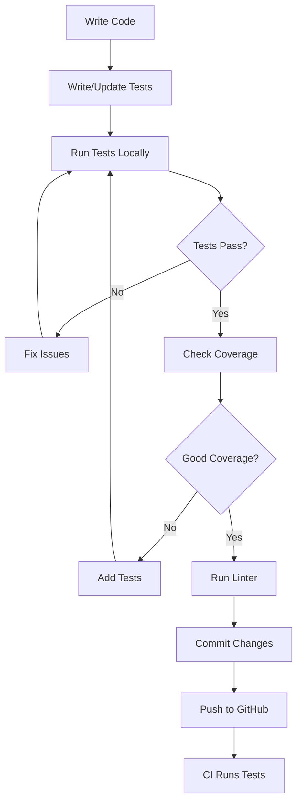

# Neural DSL - Testing System Overview

This document provides an overview of the test coverage and reporting system for Neural DSL.

## System Components

### 1. Core Script: `generate_test_coverage_summary.py`

The main script that orchestrates test execution and report generation.

**Features:**
- Runs pytest with coverage options
- Parses test results and coverage data
- Generates comprehensive markdown report
- Tracks improvements over time
- Creates HTML and JSON coverage reports

**Usage:**
```bash
python generate_test_coverage_summary.py
```

**Output:**
- `TEST_COVERAGE_SUMMARY.md` - Executive summary report
- `htmlcov/` - Interactive HTML coverage browser
- `coverage.json` - Machine-readable coverage data
- Terminal output with test statistics

### 2. Configuration Files

#### `pyproject.toml`

Contains pytest and coverage configuration:

```toml
[tool.pytest.ini_options]
- Test discovery patterns
- Custom markers
- Default options

[tool.coverage.run]
- Source paths
- Omitted files
- Branch coverage settings

[tool.coverage.report]
- Reporting options
- Excluded code patterns
```

#### `.gitignore`

Ensures generated coverage files are not tracked:
- `coverage.json`
- `htmlcov/`
- `.coverage`

### 3. Convenience Scripts

#### Windows: `run_tests_with_coverage.bat`
```batch
.\run_tests_with_coverage.bat
```

#### Unix/Linux/macOS: `run_tests_with_coverage.sh`
```bash
chmod +x run_tests_with_coverage.sh
./run_tests_with_coverage.sh
```

Both scripts:
- Check Python availability
- Run the coverage generator
- Display results
- Show how to view reports

### 4. Makefile Targets

Quick commands for common tasks:

```bash
make test              # Basic test run
make test-cov          # Tests with coverage
make test-cov-report   # Full coverage report generation
```

### 5. Documentation

#### Quick Reference: `TESTING_QUICK_REFERENCE.md`
- One-page cheat sheet
- Common commands
- Test markers
- Troubleshooting

#### Detailed Guide: `TEST_COVERAGE_README.md`
- Complete documentation
- Configuration details
- Best practices
- CI/CD integration

#### This File: `TESTING_SYSTEM_OVERVIEW.md`
- System architecture
- Component overview
- Integration points

## Workflow

### Developer Workflow



### Test Execution Flow

```
generate_test_coverage_summary.py
    |
    ├─> Run pytest with coverage
    |   ├─> Execute test suite
    |   ├─> Collect coverage data
    |   └─> Generate coverage.json
    |
    ├─> Parse results
    |   ├─> Extract test statistics
    |   ├─> Parse coverage data
    |   └─> Group by module
    |
    ├─> Compare with previous run
    |   ├─> Read old TEST_COVERAGE_SUMMARY.md
    |   ├─> Calculate deltas
    |   └─> Track improvements
    |
    └─> Generate reports
        ├─> TEST_COVERAGE_SUMMARY.md (markdown)
        ├─> htmlcov/index.html (interactive)
        └─> Terminal output (immediate feedback)
```

## Test Markers

Custom markers for test categorization:

| Marker | Purpose | Usage |
|--------|---------|-------|
| `slow` | Tests >1s | Skip with `-m "not slow"` |
| `integration` | Integration tests | Run with `-m integration` |
| `unit` | Unit tests | Run with `-m unit` |
| `requires_gpu` | Needs GPU | Skip on CPU-only systems |
| `requires_torch` | Needs PyTorch | Skip if torch not installed |
| `requires_tensorflow` | Needs TensorFlow | Skip if tf not installed |
| `requires_onnx` | Needs ONNX | Skip if onnx not installed |

### Adding New Markers

1. Edit `pyproject.toml`:
```toml
[tool.pytest.ini_options]
markers = [
    "new_marker: description",
]
```

2. Use in tests:
```python
@pytest.mark.new_marker
def test_something():
    pass
```

## Coverage Goals

### Target Coverage Levels

| Component | Minimum | Target | Critical |
|-----------|---------|--------|----------|
| **Overall** | 80% | 90% | - |
| **parser/** | 85% | 95% | Yes |
| **code_generation/** | 85% | 95% | Yes |
| **shape_propagation/** | 85% | 95% | Yes |
| **cli/** | 70% | 85% | No |
| **hpo/** | 75% | 90% | No |
| **dashboard/** | 60% | 80% | No |

### Coverage Metrics

The system tracks:
- **Line coverage**: Percentage of code lines executed
- **Branch coverage**: Percentage of code branches taken
- **Missing lines**: Specific lines not covered
- **Per-module coverage**: Coverage breakdown by module

## Integration Points

### GitHub Actions

The `.github/workflows/essential-ci.yml` workflow:
- Runs tests with coverage on every push/PR
- Uploads coverage to Codecov
- Runs on multiple Python versions (3.8, 3.11, 3.12)
- Runs on multiple OS (Ubuntu, Windows)

### Codecov Integration

Coverage reports are uploaded to Codecov for:
- Historical tracking
- PR coverage diffs
- Coverage badges
- Trend analysis

### Pre-commit Hooks

The system integrates with pre-commit hooks:
- Run linters before commit
- Can run quick tests before commit
- Prevents committing failing code

## Report Format

### TEST_COVERAGE_SUMMARY.md Structure

```markdown
# Executive Summary
- Test counts
- Pass/fail rates
- Overall coverage

# Coverage by Module
- Table of modules
- Coverage percentages
- Status indicators (🟢🟡🔴)

# Test Results Details
- Passing tests
- Failed tests
- Skipped tests
- Errors

# Coverage Report
- Links to HTML report
- Instructions for viewing

# Improvements
- Comparison with previous run
- Deltas and trends

# Recommendations
- Priority actions
- Next steps

# Full Output
- Complete pytest output
- Detailed error messages
```

### HTML Coverage Report

Interactive browser-based report:
- File browser
- Line-by-line coverage
- Syntax highlighting
- Missing line indicators
- Branch coverage details

## Maintenance

### Regular Tasks

**Daily (Developers):**
- Run tests before committing
- Check coverage for new code
- Review failing tests

**Weekly (Team):**
- Review coverage trends
- Identify untested areas
- Plan coverage improvements

**Monthly (Maintainers):**
- Update coverage goals
- Review test markers
- Update documentation

### Updating the System

**To modify coverage configuration:**
1. Edit `pyproject.toml` sections:
   - `[tool.pytest.ini_options]`
   - `[tool.coverage.run]`
   - `[tool.coverage.report]`

**To update the generator script:**
1. Edit `generate_test_coverage_summary.py`
2. Test locally
3. Update documentation if needed

**To add new convenience scripts:**
1. Create script file
2. Make executable (Unix: `chmod +x`)
3. Test on target platform
4. Document in quick reference

## Troubleshooting

### Common Issues

**"pytest not found"**
```bash
pip install pytest pytest-cov
```

**"No module named 'neural'"**
```bash
pip install -e .
```

**"No tests collected"**
- Check test file names match `test_*.py` or `*_test.py`
- Check test function names start with `test_`
- Verify you're in repository root

**"Coverage data not found"**
- Ensure pytest-cov is installed
- Check that tests actually ran
- Verify coverage.json was created

### Getting Help

1. Check quick reference: `TESTING_QUICK_REFERENCE.md`
2. Read detailed guide: `TEST_COVERAGE_README.md`
3. Review test analysis: `TEST_ANALYSIS_SUMMARY.md`
4. Open an issue on GitHub
5. Ask on Discord

## Future Enhancements

Planned improvements:

- [ ] Automatic coverage regression detection
- [ ] Integration with more CI platforms
- [ ] Coverage trend visualization
- [ ] Automatic test generation suggestions
- [ ] Performance regression detection
- [ ] Parallel test execution support
- [ ] Test result caching
- [ ] Flaky test detection

## References

- [pytest documentation](https://docs.pytest.org/)
- [pytest-cov documentation](https://pytest-cov.readthedocs.io/)
- [Coverage.py documentation](https://coverage.readthedocs.io/)
- [GitHub Actions documentation](https://docs.github.com/en/actions)
- [Codecov documentation](https://docs.codecov.com/)

---

**Version:** 1.0  
**Last Updated:** 2024  
**Maintainers:** Neural DSL Team
