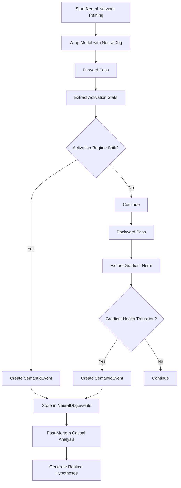
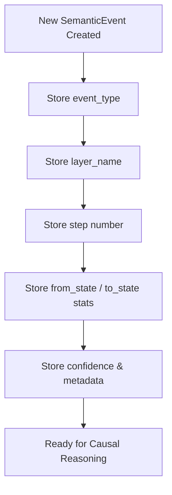
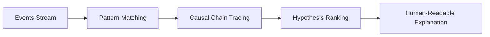

# NeuralDbg Logic Graph

This document provides a visual representation of the NeuralDbg debugging workflow and the SemanticEvent class logic.

## Overall System Logic Flow

## SemanticEvent Class Logic

## Causal Inference Workflow

This logic graph shows how NeuralDbg extracts high-level semantic events from training dynamics, focusing on transitions and shifts rather than raw tensor storage, enabling efficient causal inference.
